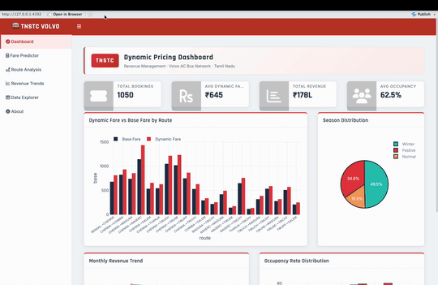

# 🚌 TNSTC Volvo Bus — Dynamic Pricing Dashboard

An R Shiny dashboard that simulates and analyses a dynamic 
pricing strategy for TNSTC Volvo AC buses across Tamil Nadu routes.

## 🚨 Business Problem
TNSTC uses fixed fares regardless of demand, season, or booking 
lead time — leaving significant revenue on the table during 
peak periods while underpricing during festive and summer seasons.

## 🔧 What This App Does
- **Real-Time Fare Predictor** — estimates dynamic fare based on season, occupancy, lead time, weekend & holiday factors
- **Route Analysis** — fare patterns and demand insights per route
- **Revenue Analytics** — seasonal revenue performance and competitor fare comparison
- **Dashboard** — KPI overview with occupancy, revenue and fare trends
- **Data Explorer** — full booking dataset with filters

## 📈 Pricing Factors
| Factor | Effect |
|--------|--------|
| Festive Season | ↑ 20–40% |
| Last-Minute (≤1 day) | ↑ 25–50% |
| High Occupancy (>90%) | ↑ 30–50% |
| Early Booking (>14 days) | ↓ 8–20% |
| Monsoon | ↓ 5–15% |

## 📊 Technical Stack
R, Shiny, shinydashboard, Plotly, DT, dplyr, lubridate, ggplot2

## 🗂️ Files
| File | Description |
|------|-------------|
| `tnstc_volvo_bus.R` | Main Shiny app code |
| `tnstc_volvo_dynamic_pricing.csv` | Booking dataset |
## 📱 App Preview

